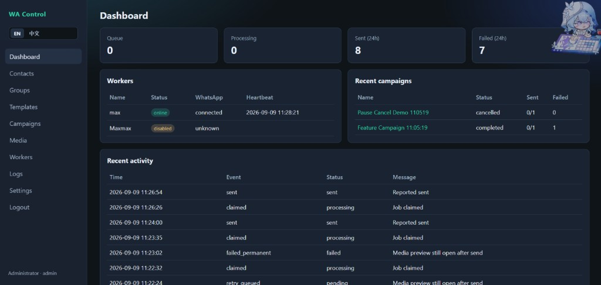
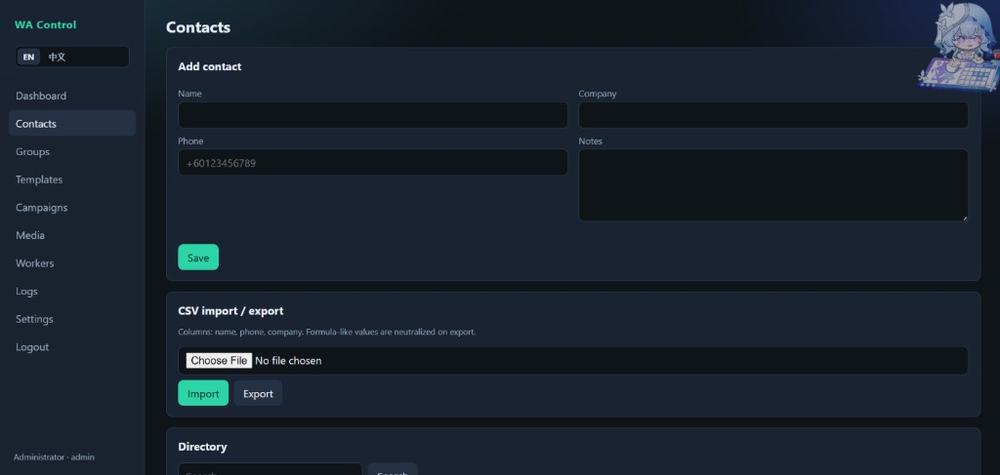
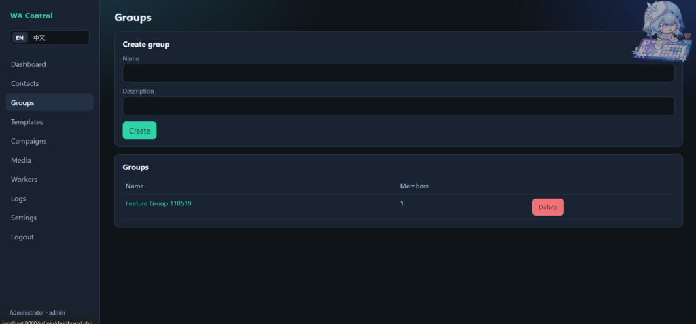
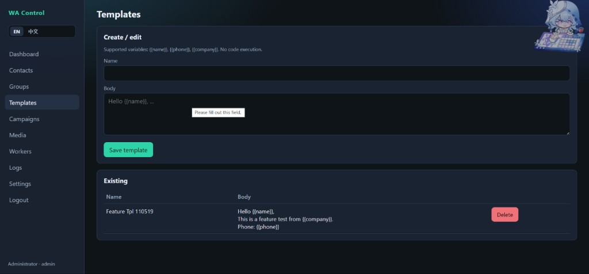
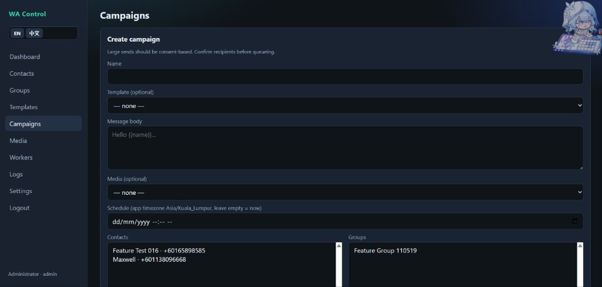
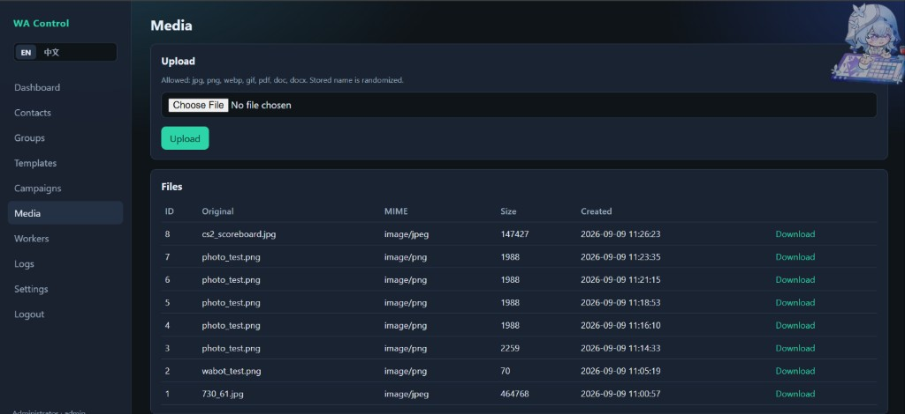
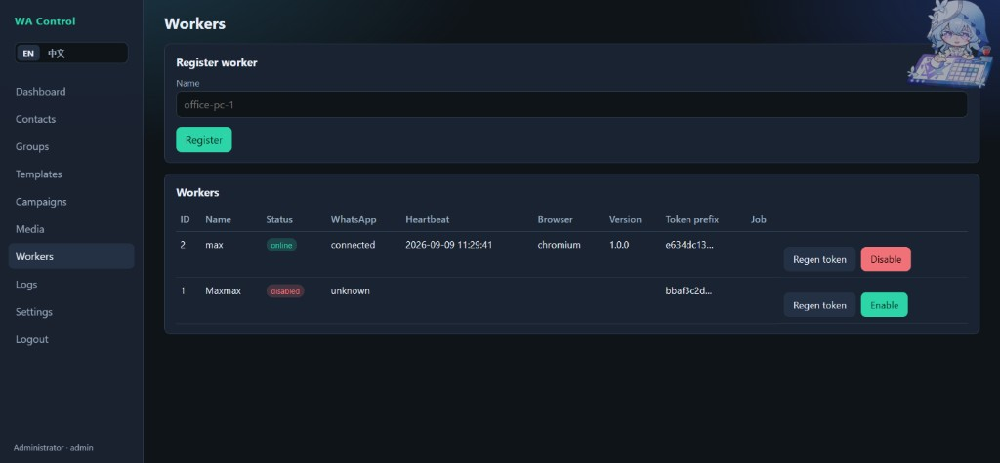
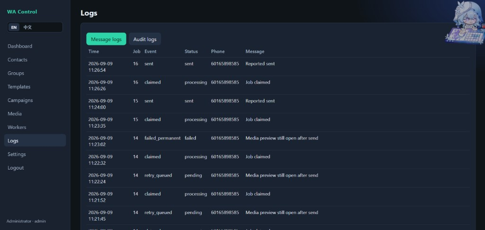

# WhatsApp Bot Control Panel

Internal **consent-based** WhatsApp messaging management platform.

**Repository:** [maxwell254112-byte/whatsapp_bot](https://github.com/maxwell254112-byte/whatsapp_bot)

```text
PHP Web Control Panel
        ↓
PHP REST API  →  MySQL
        ↑
Windows Python Worker → Playwright → WhatsApp Web
```

## Screenshots

<table>
  <tr>
    <td width="50%"></td>
    <td width="50%"></td>
  </tr>
  <tr>
    <td align="center"><b>Dashboard</b></td>
    <td align="center"><b>Contacts</b></td>
  </tr>
  <tr>
    <td width="50%"></td>
    <td width="50%"></td>
  </tr>
  <tr>
    <td align="center"><b>Groups</b></td>
    <td align="center"><b>Templates</b></td>
  </tr>
  <tr>
    <td width="50%"></td>
    <td width="50%"></td>
  </tr>
  <tr>
    <td align="center"><b>Campaigns</b></td>
    <td align="center"><b>Media</b></td>
  </tr>
  <tr>
    <td width="50%"></td>
    <td width="50%"></td>
  </tr>
  <tr>
    <td align="center"><b>Workers</b></td>
    <td align="center"><b>Logs</b></td>
  </tr>
</table>

## Features

- Admin login, CSRF, roles/permissions
- Contacts + CSV import/export, groups
- Message templates (`{{name}}`, `{{phone}}`, `{{company}}`)
- Campaigns, schedule, pause/cancel
- Media upload (authenticated download)
- Windows worker with Playwright + WhatsApp Web
- Queue claim/report, retries, stale recovery
- EN / 中文 UI

## Important

- Consent-based messaging only — no spam / ban-evasion features
- Delivery is **at-least-once** (not exactly-once)
- Unofficial WhatsApp Web automation

## Quick start (local)

1. Import `database/schema.sql`
2. Copy `web/config.example.ini` → `web/config.local.ini`
3. Open web UI, login `admin` / `admin123` (change immediately)
4. Register a worker → configure `worker/config.ini`
5. Run `worker/scripts/1_INSTALL.bat` → `2_LINK_WHATSAPP.bat` → `3_START_WORKER.bat`

## cPanel deploy

1. Upload `dist/whatsapp_bot_cpanel.zip` (or the `whatsapp_bot` folder inside it)
2. Extract so `web/` is under your domain/subdomain document root (or map subdomain to `web/`)
3. Create MySQL DB/user in cPanel, then import `database/schema.sql`
4. Copy `web/config.cpanel.example.ini` → `web/config.local.ini` and set DB + `base_url`
5. Ensure `web/uploads/` is writable
6. Run the Windows worker against your public API URL

Details: [docs/DEPLOYMENT.md](docs/DEPLOYMENT.md) · [docs/ENGINEERING_REPORT.md](docs/ENGINEERING_REPORT.md)

## Security note

Never commit `web/config.local.ini` or `worker/config.ini` (tokens/passwords). Use the example files instead.
